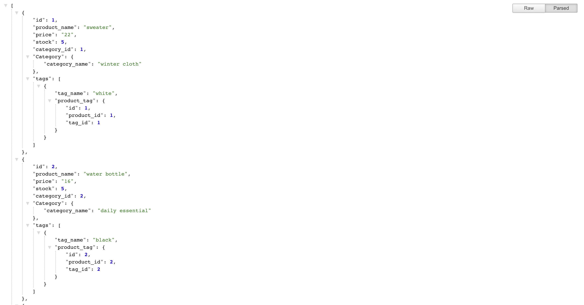

# E-Commerce-Back-End
##installation
- add the file to your local: 
git clone git@github.com:lindaluvluv/E-Commerce-Back-End.git
- install dependencies:
npm i
- go to mysql shell, input the following command and quit:
source db/schema.sql |
use ecommerce_db
- run the seeds!
npm run seed 
- run the app!
node server.js

link to the deployed app: https://quiet-eyrie-66101.herokuapp.com/api/products

